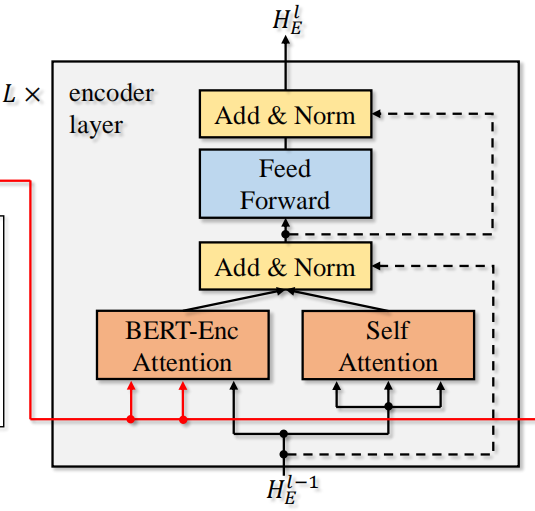
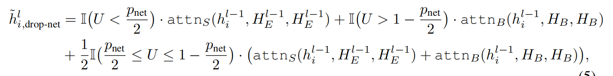
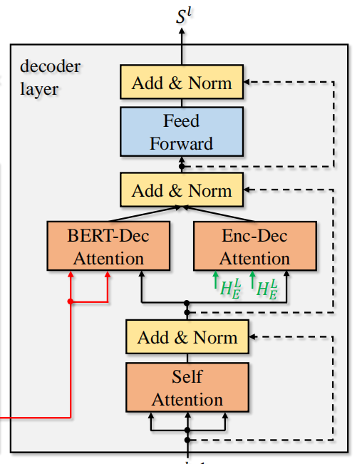

《Incorporating BERT into Neural Machine Translation》提出了一种将BERT融入神经机器翻译的方法，并且公开了<a target="_blank" href='https://github.com/bert-nmt/bert-nmt'>源码</a>
记录一下对论文实验源码的学习

### 训练模型
代码基于fairseq框架，我使用的环境是Python3.7+torch1.4，下载<a target="_blank" href='https://github.com/bert-nmt/bert-nmt'>代码</a>后需要执行:

    pip install --editable .
    
才能完成源码fairseq(源码的版本好像是0.7,但是用最新版本的fairseq训练的NMT预训练模型，可以加载成功)的环境配置

完成了en-de以及en-vi翻译任务实验，以下是该实验的大致流程

- 1.使用源码提供的脚本下载数据集
- 2.使用源码提供的BERT数据处理脚本对数据集进行处理
- 3.使用预处理脚本生成可用于训练的数据
- 4.将处理好的数据放到官方的fairseq框架，进行训练，生成预训练翻译模型
- 5.将在官方框架下训练好的模型复制到BERT-NMT项目中
- 6.开始训练BERT-NMT翻译模型

实验结果

- 使用的transformer模型参数都是transformer_iwslt_de_en模型参数
- en-vi任务中相比与基础Transformer框架而言有1个BLEU值的提升，没有达到论文中2个BLEU值提升的效果
- 迁移到en-vi任务下的实验中,也是提高了1个BLEU值
- 尝试把BERT模型换成多语言BERT模型后，下降了10个BLEU值

### 源码理解
Debug了下源码，记录以下几个部分

- 在生成平行句对训练数据的时候，生成格式和官方的格式进行对比
```bash
    # bertnmt/fairseq/data/language_pair_dataset.py
    batch = {
        'id': id,
        'nsentences': len(samples),
        'ntokens': ntokens,
        'net_input': {
            'src_tokens': src_tokens,
            'src_lengths': src_lengths,
            'bert_input': src_bert_tokens,
        },
        'target': target,
    }
    # fairseq/fairseq/data/language_pair_dataset.py
    batch = {
        'id': id,
        'nsentences': len(samples),
        'ntokens': ntokens,
        'net_input': {
            'src_tokens': src_tokens,
            'src_lengths': src_lengths,
        },
        'target': target,
    }
```
可以看出，输入句子的序列是有两个的，一个是基础的，一个是BERT分词的

-　查看model的前向传播输入src_tokens, bert_input

```
　# bertnmt/fairseq/models/transformer.py 315行
```
发现确实不一样，两个tensor的维度都是[batch_size, seq_len]，但是同一组数据中src_tokens，bert_input的seq_len并不相同，这样是不是意味着，这个融合并不是把BERT和embeding输出的词向量进行累加融合

- encoder部分


```
　# bertnmt/fairseq/models/transformer.py 1267行
  class TransformerS2EncoderLayer:
    ....
    def forward(self, x, encoder_padding_mask, bert_encoder_out, bert_encoder_padding_mask):
        # x是src_tokens进行embeding后的输出，BERT_encoder_out是bert_input在BERT进行编码后的输出，发现两个的emb_dim也不一样= =,
        residual = x 
        x = self.maybe_layer_norm(self.self_attn_layer_norm, x, before=True)
        # SelfAttention部分
        x1, _ = self.self_attn(query=x, key=x, value=x, key_padding_mask=encoder_padding_mask)
        # BertAttention部分
        x2, _ = self.bert_attn(query=x, key=bert_encoder_out, value=bert_encoder_out, key_padding_mask=bert_encoder_padding_mask)
        
        # 两个Attention把两块的维度统一了，很神奇啊
        x1 = F.dropout(x1, p=self.dropout, training=self.training)
        x2 = F.dropout(x2, p=self.dropout, training=self.training)
        
        # 算法核心，drop-net算法，get_ratio()这个算法在下面
        ratios = self.get_ratio()
        x = residual + ratios[0] * x1 + ratios[1] * x2
        x = self.maybe_layer_norm(self.self_attn_layer_norm, x, after=True)

        residual = x
        x = self.maybe_layer_norm(self.final_layer_norm, x, before=True)
        x = self.activation_fn(self.fc1(x))
        x = F.dropout(x, p=self.activation_dropout, training=self.training)
        x = self.fc2(x)
        x = F.dropout(x, p=self.dropout, training=self.training)
        x = residual + x
        x = self.maybe_layer_norm(self.final_layer_norm, x, after=True)
        return x
```

```
    def get_ratio(self):
        # 初始化模型的时候传入了参数encoder_radio，bert_ratio
        #　encoder_bert_dropout为True
        # 两个部分Attention输出的比例随缘，完全看frand的值
        if self.encoder_bert_dropout:
            frand = float(uniform(0, 1))
            if self.encoder_bert_mixup and self.training:
                return [frand, 1 - frand]
            if frand < self.encoder_bert_dropout_ratio and self.training:
                return [1, 0]
            elif frand > 1 - self.encoder_bert_dropout_ratio and self.training:
                return [0, 1]
            else:
                return [0.5, 0.5]
        # encoder_bert_dropout为False
        # 每次两个部分Attention输出按照固定的比例进行相加
        else:
            return [self.encoder_ratio, self.bert_ratio]
```

- decoder部分


```
　# bertnmt/fairseq/models/transformer.py 1267行
  class TransformerDecoderLayer:
    ....
    def forward(self,
        x,
        encoder_out=None,
        encoder_padding_mask=None,
        bert_encoder_out=None,
        bert_encoder_padding_mask=None,
        incremental_state=None,
        prev_self_attn_state=None,
        prev_attn_state=None,
        self_attn_mask=None,
        self_attn_padding_mask=None,):
      
        residual = x
        x = self.maybe_layer_norm(self.self_attn_layer_norm, x, before=True)
        if prev_self_attn_state is not None:
            if incremental_state is None:
                incremental_state = {}
            prev_key, prev_value = prev_self_attn_state
            saved_state = {"prev_key": prev_key, "prev_value": prev_value}
            self.self_attn._set_input_buffer(incremental_state, saved_state)
        x, attn = self.self_attn(
            query=x,
            key=x,
            value=x,
            key_padding_mask=self_attn_padding_mask,
            incremental_state=incremental_state,
            need_weights=False,
            attn_mask=self_attn_mask,
        )
        x = F.dropout(x, p=self.dropout, training=self.training)
        x = residual + x
        x = self.maybe_layer_norm(self.self_attn_layer_norm, x, after=True)

        if self.encoder_attn is not None:
            residual = x
            x = self.maybe_layer_norm(self.encoder_attn_layer_norm, x, before=True)
            if prev_attn_state is not None:
                if incremental_state is None:
                    incremental_state = {}
                prev_key, prev_value = prev_attn_state
                saved_state = {"prev_key": prev_key, "prev_value": prev_value}
                self.encoder_attn._set_input_buffer(incremental_state, saved_state)
            x1, attn = self.encoder_attn(
                query=x,
                key=encoder_out,
                value=encoder_out,
                key_padding_mask=encoder_padding_mask,
                incremental_state=incremental_state,
                static_kv=True,
                need_weights=(not self.training and self.need_attn),
            )
            x2, _ = self.bert_attn(
                query=x,
                key=bert_encoder_out,
                value=bert_encoder_out,
                key_padding_mask=bert_encoder_padding_mask,
                incremental_state=incremental_state,
                static_kv=True,
                need_weights=(not self.training and self.need_attn),
            )
            x1 = F.dropout(x1, p=self.dropout, training=self.training)
            x2 = F.dropout(x2, p=self.dropout, training=self.training)
            ratios = self.get_ratio()
            x = residual + ratios[0] * x1 + ratios[1] * x2
            x = self.maybe_layer_norm(self.encoder_attn_layer_norm, x, after=True)

        residual = x
        x = self.maybe_layer_norm(self.final_layer_norm, x, before=True)
        x = self.activation_fn(self.fc1(x))
        x = F.dropout(x, p=self.activation_dropout, training=self.training)
        x = self.fc2(x)
        x = F.dropout(x, p=self.dropout, training=self.training)
        x = residual + x
        x = self.maybe_layer_norm(self.final_layer_norm, x, after=True)
        if self.onnx_trace and incremental_state is not None:
            saved_state = self.self_attn._get_input_buffer(incremental_state)
            self_attn_state = saved_state["prev_key"], saved_state["prev_value"]
            return x, attn, self_attn_state
        return x, attn
```
和encoder部分区别不大，就不在赘述了

### 还要做的工作
   
- 使用该算法中文到其他语言的翻译任务
- 仔细研究drop-net算法，感觉会有更好的算法
- 尝试在解码端融入目标语言的BERT模型
- 使用跨语言模型(虽然尝试过以后效果比较差，应该是我打开方式不对)


